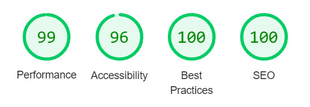
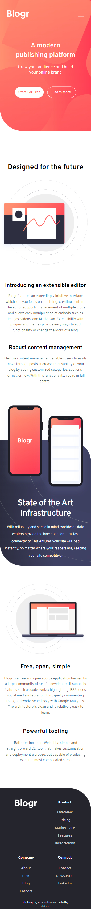

# Frontend Mentor - Blogr landing page solution

This is a solution to the [Blogr landing page challenge on Frontend Mentor](https://www.frontendmentor.io/challenges/blogr-landing-page-EX2RLAApP). Frontend Mentor challenges help you improve your coding skills by building realistic projects. 

## Table of contents

- [Overview](#overview)
  - [The challenge](#the-challenge)
  - [Screenshot](#screenshot)
  - [Links](#links)
- [My process](#my-process)
  - [Built with](#built-with)
  - [What I learned](#what-i-learned)
- [Author](#author)

## Overview

### The challenge

Users should be able to:

- View the optimal layout for the site depending on their device's screen size
- See hover states for all interactive elements on the page

### Screenshot

### Links

- Solution URL: (https://github.com/AlgirdasU/Blogr-landing-page)
- Live Site URL: (https://inquisitive-crepe-83fe26.netlify.app)

## My process

### Built with

- Semantic HTML5 markup
- CSS custom properties
- Flexbox
- CSS Grid
- SCSS
- JS

### What I learned

At first I thought this will be easy one, but I stucked and spend a lot of time on positioning of the elements in the features section. Anyway, at least it was good practice. In JS I wrote almost two times shorter code for mobile menu than before, so I am happy about that :) If anyone have sugestions, please feel free to let me know. Thank you.

## Author

- Website - [Algirdas Urbonavicius](https://github.com/AlgirdasU/Blogr-landing-page)
- Frontend Mentor - [@Algirdase](https://www.frontendmentor.io/profile/AlgirdasU)
- Twitter - [@AlgirdasDdd](https://twitter.com/algirdasddd)
